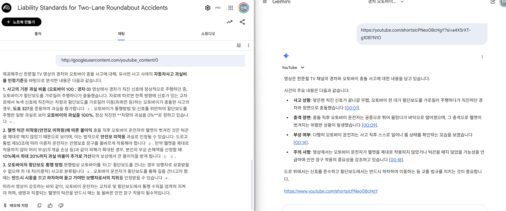

# 한블리 챗봇

### 개요

[RAG를 활용한 LLM Application 개발 (feat. LangChain) 강의 | 대시보드 - 인프런](https://biz.inflearn.com/course/rag-llm-application%EA%B0%9C%EB%B0%9C-langchain/dashboard?cid=333796)

실습을 위한 보험 설명 챗봇을 만드려고 관련 자료를 찾던 중 교통사고시 과실비율이라는 자료를 발견



위의 사진처럼 유튜브 영상 링크를 정리하여 예상 과실비율을 답해나는 챗봇을 만들고자 함.

(좌-노트북LM, 우-제미나이)

**관련 자료** → [자동차사고 과실비율 분쟁심의위원회](https://accident.knia.or.kr/) (data 폴더에 저장)

### 가상환경 세팅 및 실행

miniconda 사용

```powershell
conda create -n my-env python=3.11
conda env list
conda activate my-env
```

ipnyb 파일 실행하여 관련 라이브러리 다운 및 벡터 데이터베이스 생성

```powershell
streamlit run chat.py
```

### 코드 간단 설명

- `youtube_analyzer.py`
    - 제미나이가 직접 영상을 볼 수 있도록 함.
    - `download_youtube_video()`
        - `yt-dlp`로 유튜브 링크로 영상 다운로드
    - `analyze_video_with_gemini()`
        - 로컬에 임시 저장된 영상을 **구글 제미나이(gemini-3-flash-preview) 모델에 직접 업로드**
        - 텍스트(요약본)로 반환
        - 임시 영상 파일은 즉시 삭제
        - 프롬프트로 역할 부여
- `cli_app.py`
    - 터미널에서의 테스트 용
- `chat.py`
    - `https://youtube...` 형태의 **유튜브 링크 문자열**을 감지
        - 일반 챗봇이랑 영상분석 챗봇로 구분하여 사용 가능

### 결과

